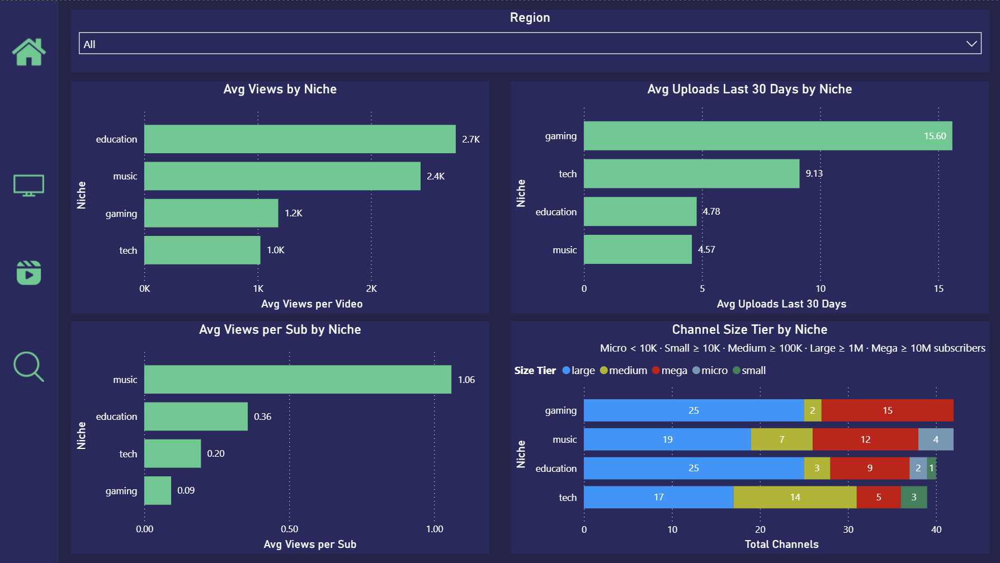
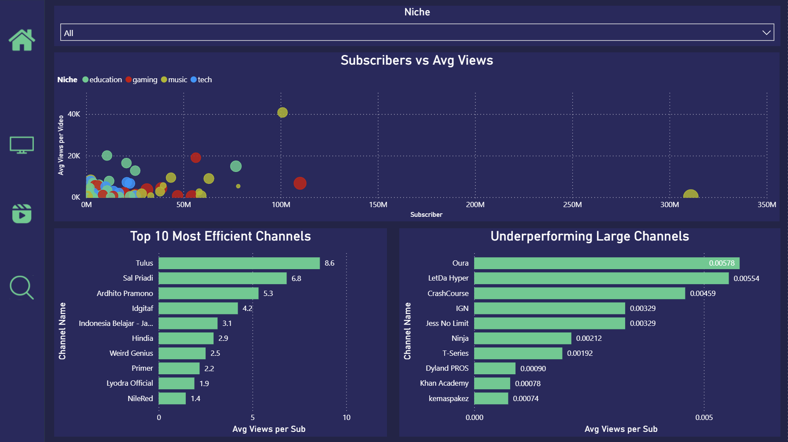
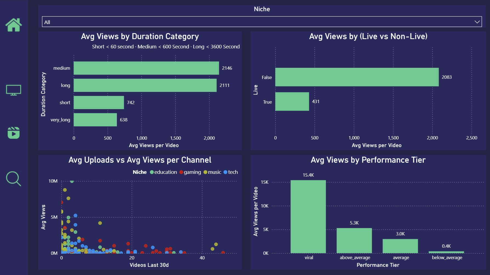

<div align="center">

# YouTube Market Intelligence

### End-to-end data platform that scrapes, transforms, and visualizes YouTube creator performance across 170+ channels and 4 content niches


[Dashboard](#-dashboard-preview) · [Power BI](#-power-bi-report-preview) · [Architecture](#-architecture) · [Data Model](#-data-model) · [Quick Start](#-quick-start) · [Tech Stack](#-tech-stack)

</div>

---

## Table of Contents

- [Overview](#overview)
- [Key Features](#-key-features)
- [Dashboard Preview](#-dashboard-preview)
- [Power BI Report Preview](#-power-bi-report-preview)
- [Architecture](#-architecture)
- [Data Pipeline](#-data-pipeline)
- [Data Model](#-data-model)
- [Quick Start](#-quick-start)
- [Project Structure](#-project-structure)
- [Tech Stack](#-tech-stack)
- [Data Coverage](#-data-coverage)
- [Performance](#-performance)
- [License](#license)

---

## Overview

YouTube Market Intelligence is a **production-grade analytics platform** that provides deep insights into the YouTube creator ecosystem. It collects public channel and video data from **170+ creators** across 4 content niches, comparing **Indonesian (ID)** and **Global** creators through automated data pipelines and interactive visualizations.

This project demonstrates end-to-end data engineering capabilities:

```
Data Extraction → Cloud Data Warehouse → Analytics Engineering → Interactive Dashboard
   (yt-dlp)          (BigQuery)              (dbt)                (Next.js)
```

---

## Key Features

### Automated Data Pipeline
- Scrapes 170+ YouTube channels without API keys using `yt-dlp`
- **Incremental processing**: only new videos are scraped each run
- Batch loading with automatic retry and error handling
- Orchestrated with Prefect for flow management

### Analytics Engineering (dbt)
- **3-layer transformation**: staging → intermediate → marts
- Star schema design with fact and dimension tables
- Data quality tests (uniqueness, not-null, accepted values)
- Automated deduplication and data cleansing

### Interactive Dashboard
- **4 analytical views**: Overview, Channel Leaderboard, Video Performance, Niche Explorer
- Real-time filtering by niche, region, and performance tier
- Radar charts, bar charts, and detailed data tables

### Scheduled Updates
- GitHub Actions workflow for weekly automated pipeline
- Incremental scraping reduces run time from ~4 hours to ~30 minutes
- BigQuery Sandbox expiration management (60-day auto-refresh)

---

## Dashboard Preview

### Overview
> KPI cards, views by niche, performance distribution, engagement comparison, and top performing videos

### Channel Leaderboard
> Filter and sort channels by niche, region, subscribers, total views, and engagement rate

### Video Performance
> Explore video metrics with multi-dimensional filtering by niche, performance tier, region, and sort criteria

### Niche Explorer
> Deep-dive comparison with radar charts, ID vs Global analysis, duration optimization, and upload day distribution

---

## Power BI Report Preview

In addition to the custom Next.js dashboard, this project includes a Power BI report designed as a stakeholder-facing insight layer. The report consumes the dbt mart tables in BigQuery and focuses on market benchmarking, channel opportunities, and content strategy patterns.

### Overview
> Executive summary with total channels, total videos, total views, average engagement rate, total views by niche, ID vs Global comparison, performance tier distribution, and average engagement rate by niche.


### Market Benchmark
> Niche-level benchmarking across average views per video, average uploads in the last 30 days, average views per subscriber, and channel size tier distribution by niche.



### Channel Opportunity Map
> Channel opportunity analysis with subscriber-to-average-view mapping, top efficient channels by average views per subscriber, and large channels that underperform on efficiency.



### Content Strategy
> Content performance analysis by duration category, live vs non-live format, upload activity vs average views, and average views by performance tier.



### Power BI Data Sources

| Report Area | BigQuery Mart Table | Purpose |
|---|---|---|
| Overview | `fct_video_performance`, `agg_niche_overview` | KPI cards, niche split, region comparison, performance tier distribution |
| Market Benchmark | `agg_niche_overview`, `agg_channel_metrics` | Niche benchmarks, upload activity, views per subscriber, size tier mix |
| Channel Opportunity Map | `agg_channel_metrics`, `dim_channels` | Channel efficiency, subscriber-to-view mapping, underperforming large channels |
| Content Strategy | `fct_video_performance`, `agg_channel_metrics` | Duration analysis, live format comparison, upload activity, performance tiers |

> Screenshot files should be placed under `docs/images/` using the filenames referenced above.

---

## Architecture

### System Overview

```
                        YouTube Market Intelligence — System Architecture

┌─────────────────────────────────────────────────────────────────────────────────┐
│                                                                                 │
│   ┌────────────┐     ┌──────────────────┐     ┌────────────┐     ┌───────────┐ │
│   │  YouTube   │────▶│  Python Scraper  │────▶│  BigQuery  │────▶│  Next.js  │ │
│   │  (Source)  │     │  (yt-dlp)        │     │  (DWH)     │     │ Dashboard │ │
│   └────────────┘     └──────────────────┘     └────────────┘     └───────────┘ │
│                              │                      │                           │
│                              ▼                      ▼                           │
│                      ┌──────────────┐        ┌───────────┐                     │
│                      │   Prefect    │        │    dbt     │                     │
│                      │ Orchestrator │        │ Transform  │                     │
│                      └──────────────┘        └───────────┘                     │
│                              │                      │                           │
│                              ▼                      │                           │
│                      ┌──────────────┐               │                           │
│                      │   GitHub     │◀──────────────┘                           │
│                      │   Actions    │  (weekly cron)                            │
│                      └──────────────┘                                           │
│                                                                                 │
└─────────────────────────────────────────────────────────────────────────────────┘
```

### Pipeline Flow

```
PHASE 1 — EXTRACT                PHASE 2 — LOAD              PHASE 3 — TRANSFORM
┌─────────────────────┐          ┌─────────────────┐         ┌─────────────────────┐
│ yt-dlp scrapes:     │          │ Pandas DataFrame │         │ dbt models:         │
│ • Channel metadata  │─────────▶│ → BigQuery       │────────▶│ • staging/          │
│ • Video statistics  │          │   (APPEND mode)  │         │ • intermediate/     │
│ • 170+ channels     │          │                  │         │ • marts/            │
└─────────────────────┘          └─────────────────┘         └─────────────────────┘
                                                                       │
PHASE 4 — SERVE                                                        │
┌─────────────────────┐                                                │
│ Next.js API routes  │◀───────────────────────────────────────────────┘
│ → Recharts viz      │   (queries BigQuery marts directly)
│ → 4 dashboard pages │
└─────────────────────┘
```

---

## Data Pipeline

### Full Ingestion (First Run)

```bash
uv run python -m pipeline.src.flows.ingest_all
```

| Step | What happens | Duration |
|---|---|---|
| Load channel config | Read 170 channels from YAML | ~1s |
| Scrape channels | yt-dlp extracts metadata + videos | ~3.5 hours |
| Batch load | DataFrames → BigQuery (batches of 10) | ~5 min |
| **Total** | | **~3.75 hours** |

### Incremental Ingestion (Weekly)

```bash
uv run python -m pipeline.src.flows.ingest_incremental
```

| Step | What happens | Duration |
|---|---|---|
| Query BigQuery | Get existing video_ids | ~5s |
| Check channels | Get video lists, compare with existing | ~10 min |
| Scrape new only | Only scrape videos not in BigQuery | ~15-30 min |
| Batch load | APPEND new data | ~2 min |
| **Total** | | **~15-45 min** |

### How Incremental Works

```
Channel A (active):    30 videos on YouTube → 10 in BigQuery → 20 new → scrape 20
Channel B (inactive):  10 videos on YouTube → 10 in BigQuery →  0 new → SKIP (0 sec)
Channel C (new video): 11 videos on YouTube → 10 in BigQuery →  1 new → scrape 1
```

---

## Data Model

### Star Schema (dbt)

Fact table at the center, dimension and aggregate tables radiate outward

```
                          ┌───────────────────────┐
                          │     dim_channels       │
                          │     (Dimension)        │
                          │───────────────────────│
                          │ channel_id (PK)        │
                          │ channel_name           │
                          │ channel_url            │
                          │ niche, region          │
                          │ subscriber_count       │
                          │ size_tier              │
                          └───────────┬───────────┘
                                      │
                                      │ channel_id (FK)
                                      │
┌─────────────────────┐    ┌──────────┴──────────┐    ┌─────────────────────┐
│ agg_channel_metrics │    │  fct_video_         │    │  agg_niche_overview │
│    (Aggregate)      │◀───│  performance        │───▶│    (Aggregate)      │
│─────────────────────│    │  ★ FACT TABLE ★     │    │─────────────────────│
│ channel_id          │    │─────────────────────│    │ niche               │
│ total_videos        │    │ video_id (PK)       │    │ total_channels      │
│ total_views         │    │ channel_id (FK)     │    │ total_videos        │
│ avg_views           │    │ view_count          │    │ avg_views_per_video │
│ avg_engagement_rate │    │ like_count          │    │ avg_engagement_rate │
│ avg_views_per_sub   │    │ comment_count       │    │ median_views        │
│ avg_views_per_day   │    │ engagement_rate     │    └─────────────────────┘
│ videos_last_30d     │    │ views_per_day       │
└─────────────────────┘    │ performance_tier    │
                           │ duration_category   │
                           └─────────────────────┘
```

### Design Principles

- **`dim_channels`**: Pure dimension: only descriptive attributes (who), no aggregated measures
- **`fct_video_performance`**: Central fact table: all video-level measures, references `dim_channels` via FK
- **`agg_channel_metrics`**: Pre-computed channel rollups for dashboard performance
- **`agg_niche_overview`**: Pre-computed niche benchmarks for cross-niche comparison
- Dashboard API routes **JOIN fact + dimension** at query time — proper star schema usage

### Transformation Layers

| Layer | Models | Materialization | Purpose |
|---|---|---|---|
| **Staging** | `stg_channels`, `stg_videos` | View | Clean, deduplicate, type-cast raw data |
| **Intermediate** | `int_video_metrics`, `int_channel_summary`, `int_niche_benchmarks` | View | Compute metrics, join tables, aggregate |
| **Marts** | `dim_channels`, `fct_video_performance`, `agg_channel_metrics`, `agg_niche_overview` | Table | Star schema dimension, fact, aggregates |

### Key Computed Metrics

| Metric | Formula | Purpose |
|---|---|---|
| `engagement_rate` | (likes + comments) / views | Content quality indicator |
| `like_rate` | likes / views | Audience approval ratio |
| `views_per_subscriber` | views / subscriber_count | Content reach efficiency |
| `views_per_day` | views / days_since_upload | Content velocity |
| `performance_tier` | Based on views vs niche median | Viral / Above Avg / Average / Below Avg |
| `size_tier` | Based on subscriber count | Mega (10M+) / Large (1M+) / Medium / Small |

### Data Quality Tests

```yaml
- unique: [channel_id, video_id]
- not_null: [channel_id, video_id, channel_name]
- accepted_values:
    niche: [gaming, tech, education, music]
    region: [ID, GLOBAL]
```

---

## Quick Start

### Prerequisites

| Tool | Version | Purpose |
|---|---|---|
| Python | 3.11+ | Pipeline runtime |
| [uv](https://docs.astral.sh/uv/) | Latest | Python package manager |
| Node.js | 18+ | Dashboard runtime |
| GCP Account | — | BigQuery (Sandbox is free) |

### 1. Clone & Install

```bash
git clone https://github.com/YOUR_USERNAME/youtube-intelligence.git
cd youtube-intelligence

# Python dependencies
uv sync

# Dashboard dependencies
cd dashboard && npm install && cd ..
```

### 2. Configure GCP

1. Create a GCP project with BigQuery API enabled
2. Create a Service Account with **BigQuery Data Editor** role
3. Download the JSON key → save as `credentials/sa-key.json`

### 3. Set Environment Variables

**Root `.env`:**
```env
GOOGLE_APPLICATION_CREDENTIALS=credentials/sa-key.json
GCP_PROJECT_ID=your-gcp-project-id
BQ_DATASET_RAW=youtube_raw
BQ_DATASET_ANALYTICS=youtube_analytics
```

**`dashboard/.env.local`:**
```env
GCP_PROJECT_ID=your-gcp-project-id
BQ_DATASET=youtube_analytics_marts
GOOGLE_APPLICATION_CREDENTIALS=credentials/sa-key.json
```

### 4. Run Pipeline

```bash
# Full ingestion (~3.75 hours first time)
uv run python -m pipeline.src.flows.ingest_all

# Transform with dbt
cd dbt
uv run dbt run --profiles-dir .
uv run dbt test --profiles-dir .
```

### 5. Start Dashboard

```bash
cd dashboard
npm run dev
# → http://localhost:3000
```

### 6. Incremental Updates (subsequent runs)

```bash
# Only scrape new videos (~15-30 min)
uv run python -m pipeline.src.flows.ingest_incremental

# Rebuild models
cd dbt && uv run dbt run --profiles-dir .
```

---

## Project Structure

```
youtube-intelligence/
│
├── pipeline/                         # ── DATA EXTRACTION LAYER ──
│   ├── src/
│   │   ├── config/
│   │   │   └── channels_validated.yaml   # 170+ channel definitions
│   │   ├── ingestion/
│   │   │   └── youtube_scraper.py        # yt-dlp scraper (channel + video metadata)
│   │   ├── loaders/
│   │   │   └── bigquery_loader.py        # BigQuery batch loader + expiration mgmt
│   │   ├── flows/
│   │   │   ├── ingest_all.py             # Full ingestion (Prefect flow)
│   │   │   └── ingest_incremental.py     # Weekly incremental (Prefect flow)
│   │   └── utils/
│   │       ├── config.py                 # Environment config loader
│   │       └── logger.py                 # Loguru-based logging
│   └── tests/
│       └── test_bigquery.py              # BigQuery connectivity tests
│
├── dbt/                              # ── DATA TRANSFORMATION LAYER ──
│   ├── models/
│   │   ├── staging/                      # Clean & deduplicate
│   │   │   ├── stg_channels.sql
│   │   │   ├── stg_videos.sql
│   │   │   ├── _sources.yml
│   │   │   └── _staging.yml              # Schema tests
│   │   ├── intermediate/                 # Metrics & aggregations
│   │   │   ├── int_video_metrics.sql
│   │   │   ├── int_channel_summary.sql
│   │   │   └── int_niche_benchmarks.sql
│   │   └── marts/                        # Star schema tables
│   │       ├── dim_channels.sql          # Dimension: channel attributes
│   │       ├── fct_video_performance.sql  # Fact: video measures + FK
│   │       ├── agg_channel_metrics.sql    # Aggregate: channel rollups
│   │       └── agg_niche_overview.sql     # Aggregate: niche benchmarks
│   ├── dbt_project.yml
│   └── profiles.yml
│
├── dashboard/                        # ── VISUALIZATION LAYER ──
│   └── src/
│       ├── app/
│       │   ├── page.tsx                  # Overview (KPIs + charts)
│       │   ├── channels/page.tsx         # Channel leaderboard
│       │   ├── videos/page.tsx           # Video performance explorer
│       │   ├── niches/page.tsx           # Niche deep-dive
│       │   └── api/                      # BigQuery API routes
│       │       ├── overview/route.ts
│       │       ├── channels/route.ts
│       │       ├── videos/route.ts
│       │       └── niches/route.ts
│       ├── components/
│       │   ├── Sidebar.tsx
│       │   └── StatCard.tsx
│       └── lib/
│           └── bigquery.ts               # BigQuery Node.js client
│
├── .github/
│   └── workflows/
│       └── weekly_pipeline.yml           # Automated weekly pipeline
│
├── pyproject.toml                        # Python dependencies (uv)
├── README.md
└── .gitignore
```

---

## Tech Stack

| Layer | Technology | Why This Choice |
|---|---|---|
| **Extraction** | yt-dlp | No API key needed, reliable, handles rate limits |
| **Orchestration** | Prefect | Task retries, logging, flow management |
| **Data Warehouse** | Google BigQuery | Serverless, free Sandbox tier, SQL analytics |
| **Transformation** | dbt-core | SQL-based modeling, testing, documentation |
| **Dashboard** | Next.js 15 + TypeScript | SSR, API routes, fast development |
| **BI Reporting** | Power BI | Executive insight layer for stakeholder-facing analysis |
| **Charts** | Recharts | React-native, composable, customizable |
| **Styling** | Custom CSS | Dark theme, glassmorphism, no framework overhead |
| **Icons** | Lucide React | Clean SVG icons, tree-shakeable |
| **CI/CD** | GitHub Actions | Free, integrated, cron scheduling |
| **Package Mgmt** | uv (Python) + npm (JS) | Fast, reliable dependency resolution |

---

## Data Coverage

### Channels by Niche × Region

| Niche | Indonesia | Global | Total | Example Creators |
|---|---|---|---|---|
| **Gaming** | ~25 | ~15 | ~40 | MrBeast Gaming, Windah Basudara, Jess No Limit |
| **Tech** | ~15 | ~25 | ~40 | Fireship, MKBHD, Linus Tech Tips |
| **Education** | ~15 | ~25 | ~40 | Mark Rober, Kurzgesagt, Kok Bisa |
| **Music** | ~15 | ~15 | ~30 | Bruno Mars, BLACKPINK, Tulus |
| **Total** | **~70** | **~80** | **~170** | |

### Metrics Tracked

- **Channel-level**: subscribers, total views, video count, upload frequency, engagement averages
- **Video-level**: views, likes, comments, duration, upload date, tags, performance tier
- **Niche-level**: benchmarks, medians, cross-niche comparisons, duration analysis

---

## Performance

| Metric | Value |
|---|---|
| Full ingestion (170 channels × 10 videos) | ~3.75 hours |
| Incremental run (new videos only) | ~15-45 minutes |
| dbt build (8 models + 7 tests) | ~30 seconds |
| Dashboard cold start | ~2 seconds |
| API response time (BigQuery query) | ~1-3 seconds |

---

## License

MIT see [LICENSE](LICENSE) for details.

---

<div align="center">

**Built with ❤️ by Mugni Hidayah**

</div>
